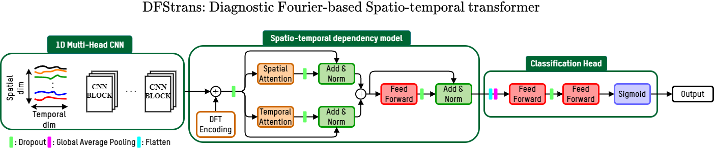

# Diagnostic Spatio-temporal Transformer with Faithful Encoding

This repository is the official implementation of "Diagnostic Spatio-temporal Transformer with Faithful Encoding". 




## Requirements

To install requirements:

```setup
pip install -r requirements.txt
```
## Download dataset

If you are interested in downloading the dataset, please contact us and we will send you the link to download it.

## Training

To train DFStrans on the elevator's use-case, run this:

```train
python main.py --data_path <path_to_data> 
```


## Evaluation

To evaluate DFStrans on the elevator's use-case, run this:

```eval
python main.py --data_path <path_to_data> --eval
```


## Results

Our model achieves the following performance on :


|     Model name     |    Precision    |     Recall     |     F1-Score     |
| ------------------ |---------------- | -------------- | ---------------- | 
| DFStrans           |      0.979      |     0.955      |      0.967       |
| Strans             |      0.977      |     0.917      |      0.946       | 
| MultiHead1DCNN     |      0.993      |     0.914      |      0.951       | 
| InceptionTime      |        1        |     0.892      |      0.944       |
| TapNet             |      0.398      |     0.711      |      0.510       |
| MLSTM-FCN          |      0.913      |     0.724      |      0.808       |


